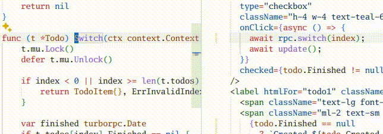

<div align="center">


TurboRPC: Full-Stack Type Safety Without The Work



[](https://godoc.org/github.com/turborpc/turborpc)

[](https://goreportcard.com/report/github.com/turborpc/turborpc)

</div>

## Why TurboRPC?

- ⚡️ **Zero Boilerplate** - Write normal Go methods, get a TypeScript client
- 🔒 **Type Safety** - Full end-to-end type safety between Go and TypeScript
- 🚀 **Developer Experience** - No code generation steps or build processes
- 🔌 **Drop-in Integration** - Works with standard `net/http` - no special setup
- 📦 **Zero Dependencies** - Uses only Go standard library

## Installation

```bash
go get github.com/turborpc/turborpc
```

## Example

```go
package main

import (
    "context"
    "net/http"
    "sync/atomic"

    "github.com/turborpc/turborpc"
)

type Counter atomic.Int64

func (c *Counter) Add(ctx context.Context, delta int64) (int64, error) {
    return (*atomic.Int64)(c).Add(delta), nil
}

func main() {
    rpc := turborpc.NewServer()

    _ = rpc.Register(&Counter{})

    rpc.WriteTypeScriptClient("client.ts")

    http.Handle("/rpc", rpc)

    http.ListenAndServe(":3000", nil)
}
```

```typescript
import { Counter } from "./client.ts";

const rpc = new Counter("http://localhost:3000/rpc");
const newValue = await rpc.add(1); // Fully typed!!
```

## Documentation

- [API Reference](https://godoc.org/github.com/turborpc/turborpc)
- [Examples Repository](https://github.com/turborpc/examples)

## Status

⚠️ **Warning**: TurboRPC is currently in pre-alpha. Please use with caution in production environments.
